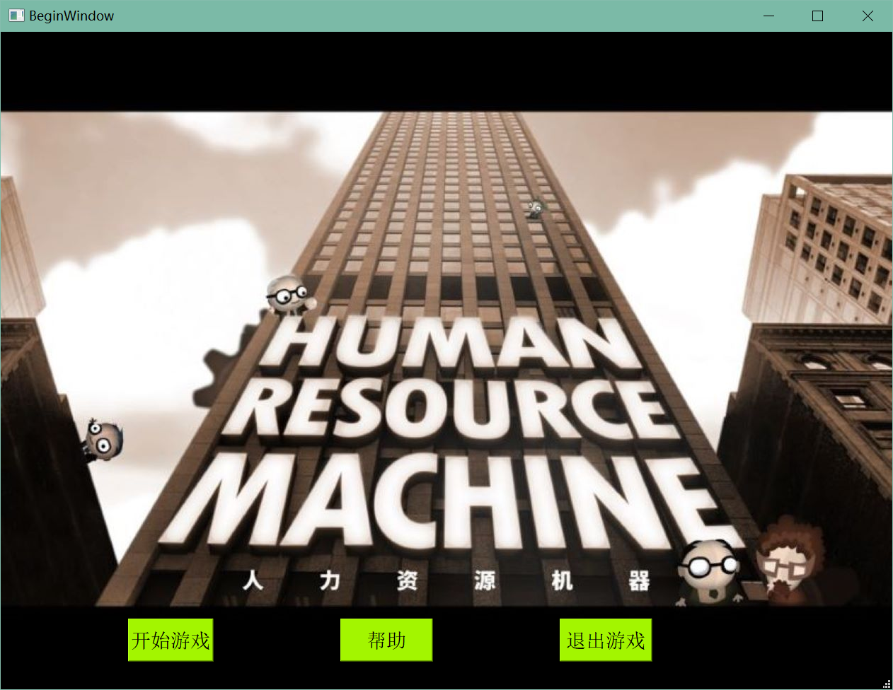
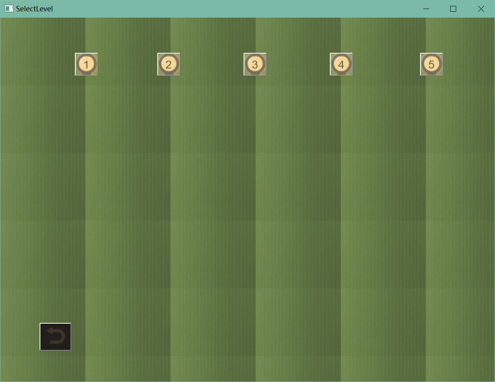
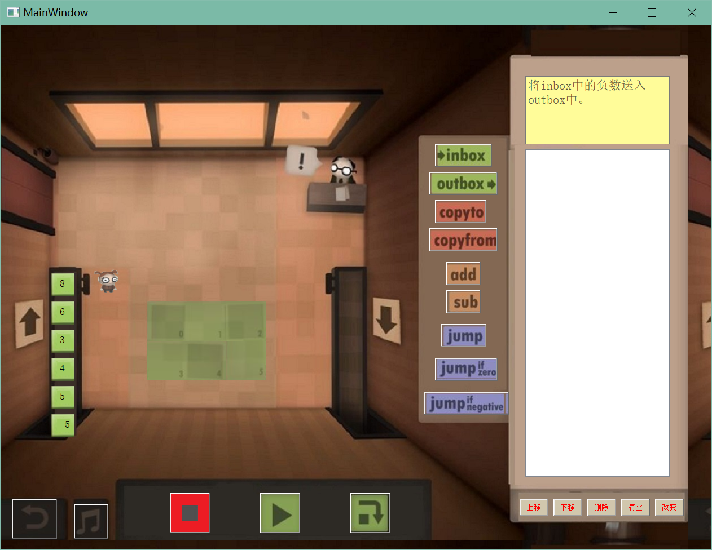
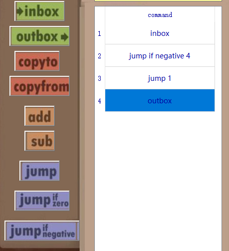
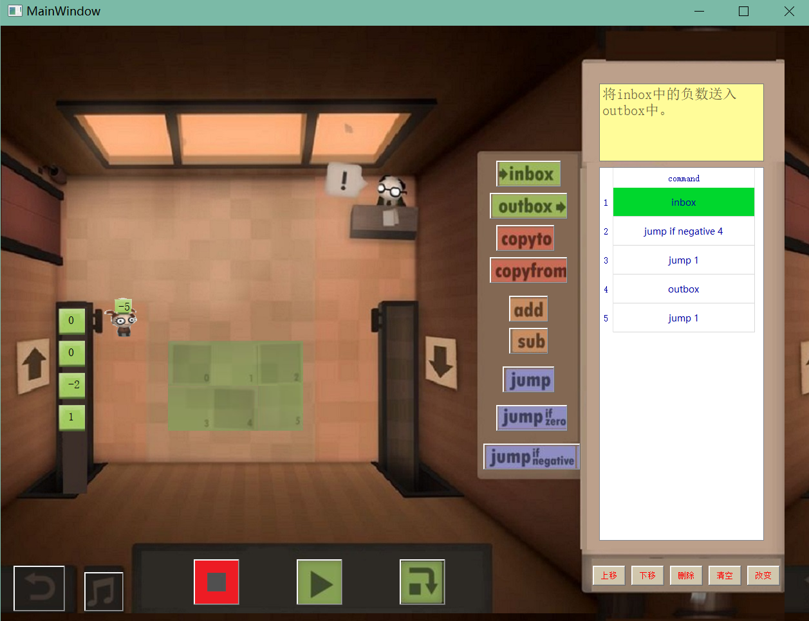
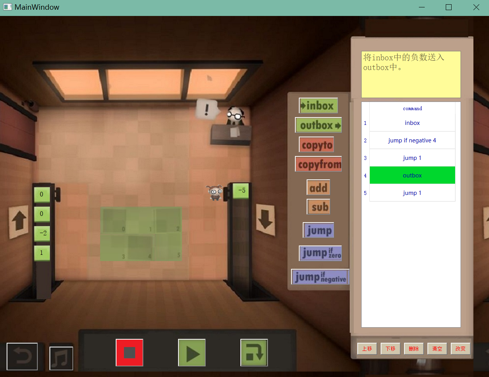

## Human resource Machine总报告

----

### 问题与背景
-----

Human resource Machine是一款有趣的基于视觉编程的益智游戏。玩家从提供的基本命令创建指令列表，以控制工具人在办公室中的行动。办公室包括一个inbox，一个outbox，还有中间可容纳盒子的方块。每一关中，玩家根据提示，编写指令，从inbox中取出符合要求的方块，按顺序放入outbox中。

### 分工与开发计划

----

#### 本组成员：

- 赵明心
- 许津铭

#### 工程分工：

- 赵明心：主要界面开发；持续集成配置；得到移动信号后对人物以及方块的移动；将几个层拼接(view层，App层)；
- 许津铭：命令的设计；命令的解释，由命令得到人物、方块的移动信号；一些用于层之间传递信号变量的设置；(viewmodel层，model层)

#### 开发计划：

​    1.赵明心、许津铭先一起搭建MVVM框架，定好App层的一些共同信号；

​    2.赵明心对界面进行开发，对关卡的设计；许津铭设计命令，以及开发命令的解释器；

​	3.根据App层的共同信号，由赵明心将几个层进行整合。

### 每轮迭代效果说明

- 第一轮迭代效果：完成MVVM框架的搭建；完成基本游戏主界面设计以及一些命令的编辑；
- 第二轮迭代效果：完成根据命令解释出移动信息；根据移动信息操控人物移动；并初步做到模块间协作
- 第三轮迭代效果：完善了命令设计；完成了选关界面设计；完成几个关卡的设计，对于每关都能运行并查看结果；
- 第四轮迭代效果：加入了单步调试，音乐等小功能；修复一些测试中遇到的命令解释、人物移动Bug

### 最终运行效果图：

----

#### 1.开始界面

#### 2.关卡选择界面

#### 3.游戏主界面

#### 4.点击左侧按钮，往命令界面中添加命令。

#### 5.命令下面的这五个按钮，可以更加方便地对命令进行调整。

#### 6.播放音乐

#### 7.分别是停止运行，运行并显示最终结果，单步运行

#### 8.单步运行

可以看到随着单步执行，左侧人物、盒子进行移动，右侧执行的指令也会高亮。

#### 9.步数统计

