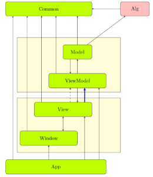

## Human Resource Machine分报告

----

#### 赵明心    3170102570

------

### 分工任务的解决方案

-----

#### 1.工程框架

虽然是野路子的MVVM，但是还是想讲一下我们协作的思路。

工程主要分为 View、Viewmodel、Model、Common 和 App 五层。其中common层主要是存放联系其它几个层的信号变量。前期先把common层定好，就可以开始分头开发，viewmodel与model层由一人开发，而view由一人开发。最后再由App层，利用common层作为沟通媒介，对几个层进行调用。

据我们的想法，View 与 Viewmodel 是能做到解耦和的，就可以达到独立开发的要求。不过，对于一些更加大型的工程，可能common层就比较难以定下来，我们这套方法也就不适用了。



#### 2.持续集成等工具链设置

本项目使用 Appveyor 进行云端持续集成

#### 3.整体界面设计

首先利用Qt Creator直接调用一些控件对界面进行绘制，然后对于需要进行变化的对象，比如人物图片，以及一些盒子图片，都使用代码进行制作，每次根据状态更换图片、文字，以及调整位置。

#### 4.人物移动

- 设计思路

人物状态的变化：人物的样子放在一个label中。由carry来存人物是否携带，由content来存人物携带盒子中的值。然后在状态变化时，根据这两个值来改变label中的图片和文本内容。

- 具体实现

使用Qt中的一个QPropertyAnimation类来实现人物移动动画，它可以做到对一张图片进行移动，并能够指定时间、关键点，还能够实现移动中伴随大小变化。

```c++
QPropertyAnimation *animation = new QPropertyAnimation(ui->label, "geometry");
animation->setDuration(1000);
//  设置动画的起始状态
animation->setStartValue(QRect(155, 420, 68, 68));
//  设置动画过程中的关键节点(这里是终止点)
animation->setKeyValueAt(1, QRect(520, 420, 68, 68));

//  设置动画效果

//  开始执行动画 QAbstractAnimation::DeleteWhenStopped 动画结束后进行自清理(效果就好像智能指针里的自动delete animation)
animation->start(QAbstractAnimation::DeleteWhenStopped);
   
```

#### 5.命令编辑

- 设计思路

命令的编辑，需要做到能够按下按钮添加，并且能够对选中命令进行删除、上移、下移。

- 具体实现

使用Qt中的QTableView来实现命令的逐行显示，并且能做到添加、删除以及调序，正好适合命令的编辑。

#### 6.组装代码

将model、viewmodel、view、common几个层进行合并,在main中进行调用，并在其中其中写了几个游戏界面之间切换的逻辑。

----

### 心得体会

MVVM设计模式的搭建确实比较繁琐，最初花了好几天来理解、尝试这个模式。

我们自认为是做到了独立开发并最终协作的要求，但是未能成功达成老师的预期要求。只是一个"野路子"。

不过我们也对MVVM模式也有了一定的理解，并初步实践了这种利用MVVM模式与github进行协作的方式，在开发中省去了互拷文件与反复沟通的环节，大大加快了开发的效率。

并且也熟悉了github与appveyor的使用，对于以后的课程、工作都会有极大的帮助。

-----

### 课程建议

希望老师能够拿一个往届的样例，给我们作为MVVM框架的参考，并提供一些必要的注释，这样配合老师的讲解，相信这样会有更多人把MVVM模式做出来。